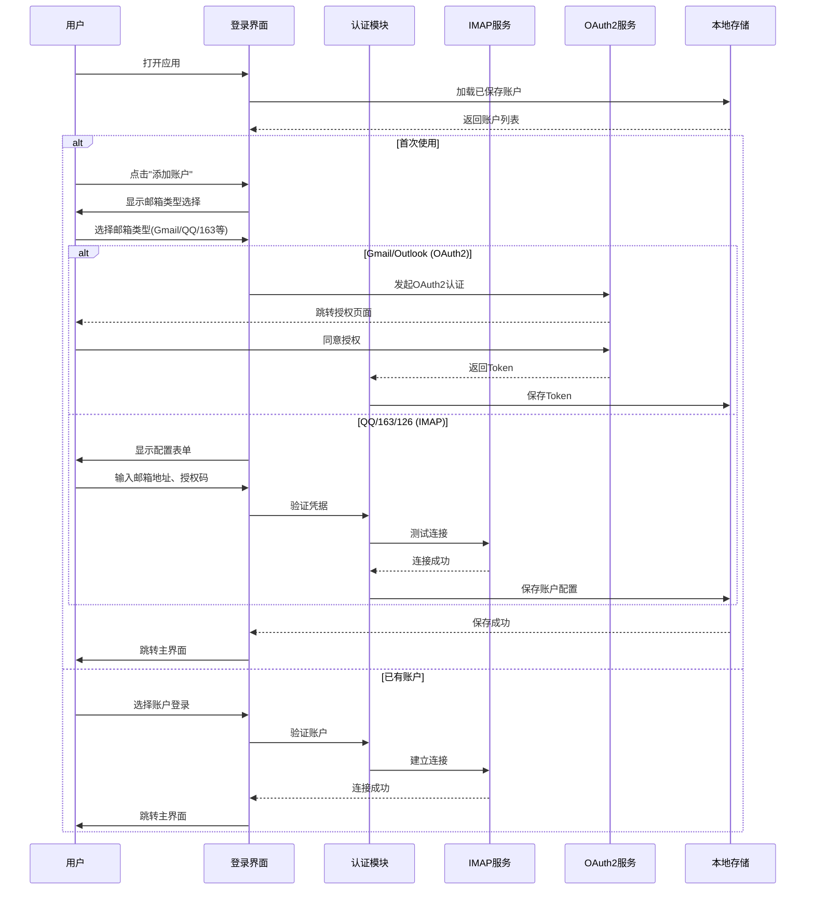
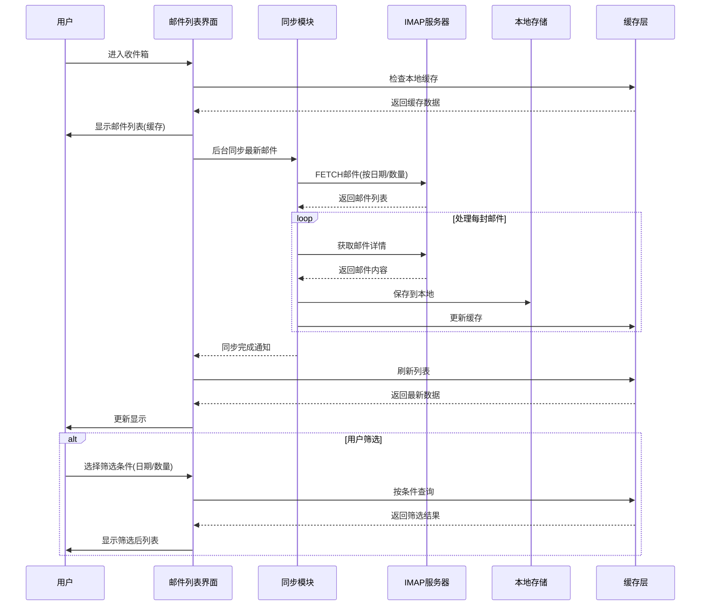
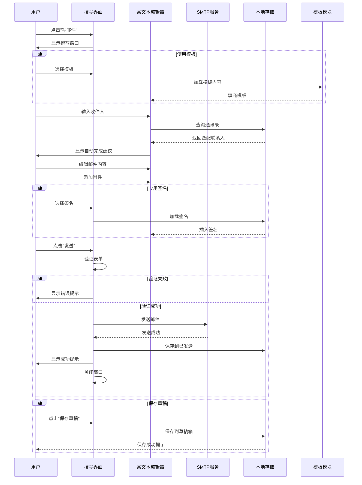
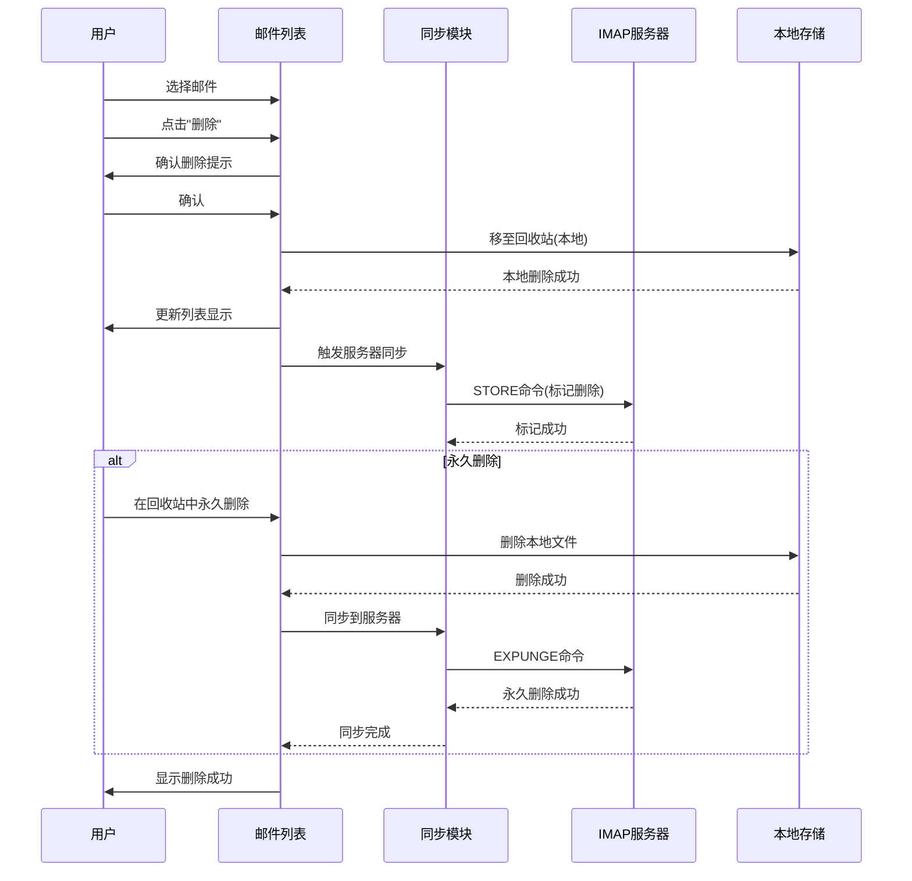
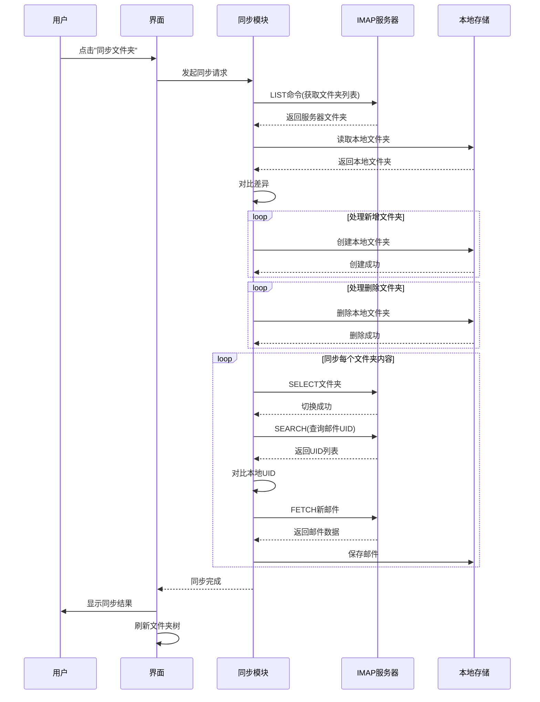
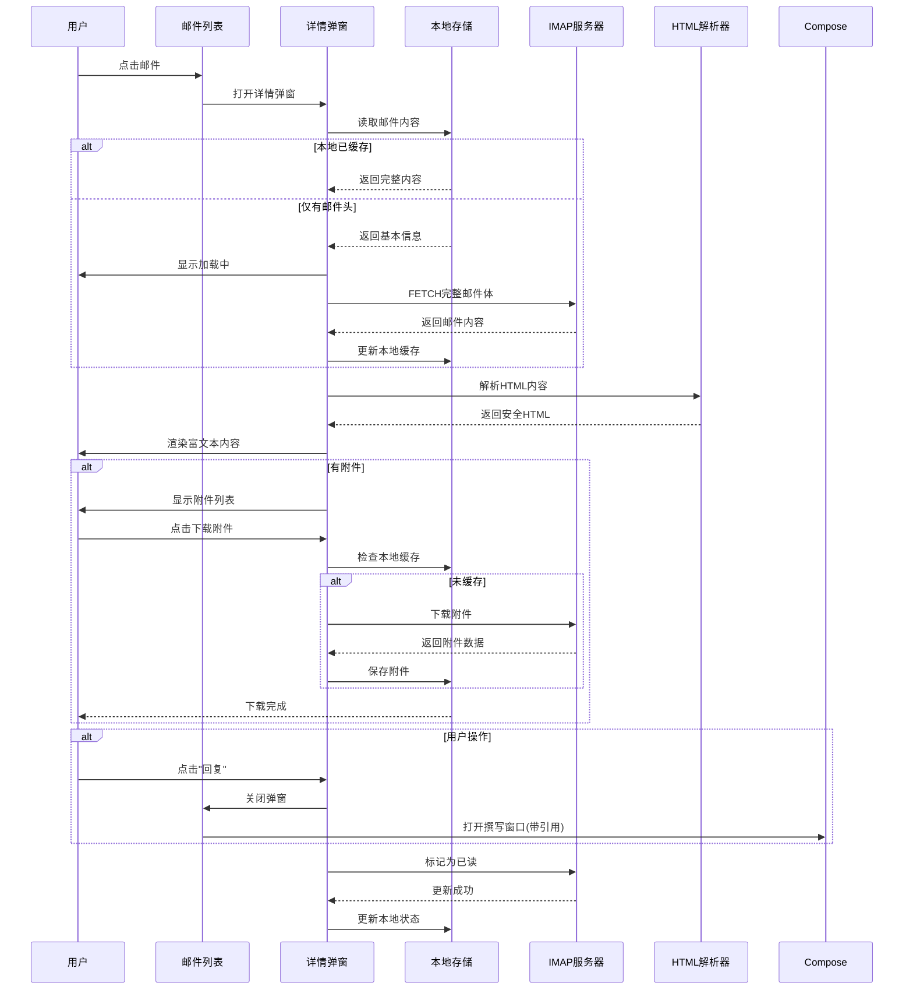
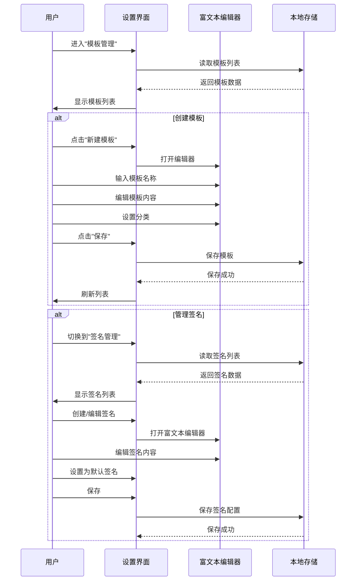
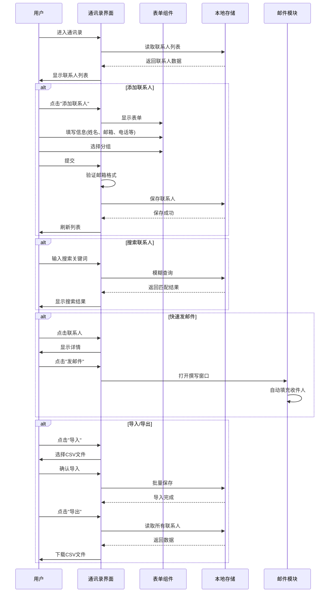
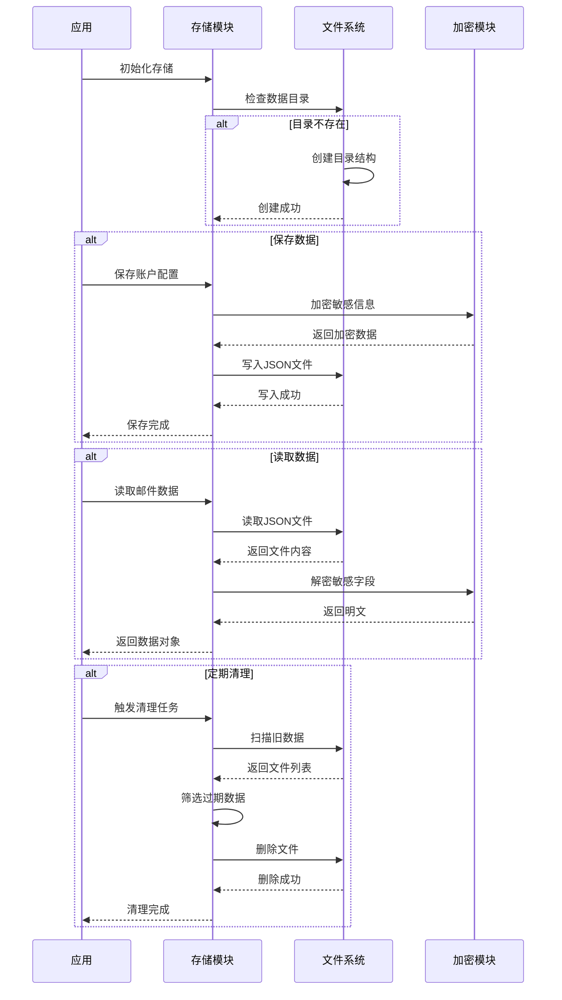
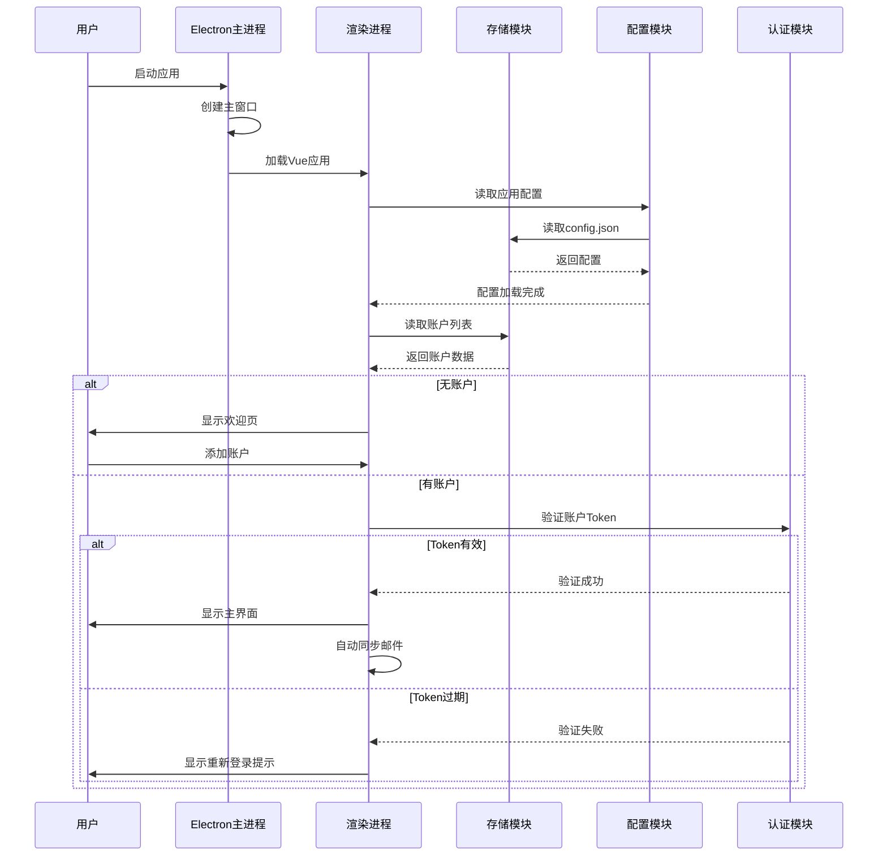

# Maillionaire - UI交互时序图

## 1. 用户登录与账户管理流程

## 2. 邮件收取流程

## 3. 邮件发送流程

## 4. 邮件删除与同步流程

## 5. 文件夹同步流程

## 6. 邮件详情查看流程

## 7. 模板与签名管理流程

## 8. 通讯录管理流程

## 9. 本地数据存储交互流程

## 10. 应用启动流程

---

**文档版本**: v1.0  
**创建日期**: 2025-10-19  
**说明**: 本文档包含Maillionaire邮件客户端的核心功能交互时序图，展示了用户操作、系统模块、外部服务之间的交互流程。
