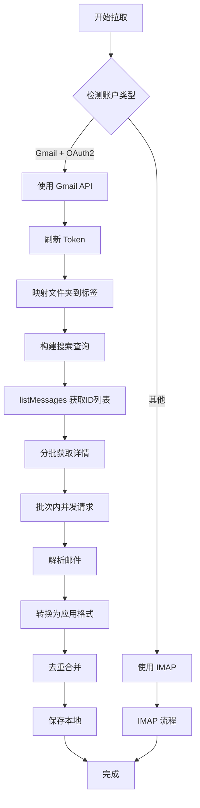
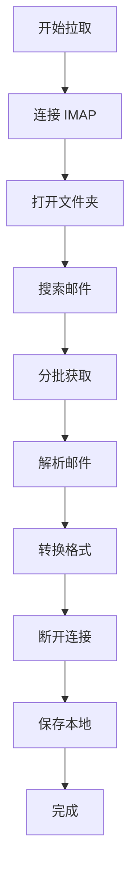

# Gmail 邮件拉取 API 集成

**日期**: 2025-10-22  
**功能**: Gmail 邮件拉取使用 Gmail API 替代 IMAP  
**状态**: ✅ 已完成

## 功能概述

将 Gmail 账户的邮件拉取从 IMAP 协议改为 Gmail API v1，提供更好的性能和更准确的数据。

### 优势对比

| 特性 | IMAP | Gmail API |
|------|------|-----------|
| **性能** | ⚠️ 较慢，需要解析邮件 | ✅ 快速，直接获取结构化数据 |
| **数据准确性** | ⚠️ 标签映射可能不准 | ✅ 原生 Gmail 标签支持 |
| **网络开销** | ⚠️ 需要下载完整邮件 | ✅ 可选择性获取字段 |
| **连接管理** | ⚠️ 需要维护长连接 | ✅ 无状态 REST API |
| **批量操作** | ⚠️ 串行处理 | ✅ 支持并发请求 |
| **代理支持** | ✅ 支持 | ✅ 支持 |

## 技术实现

### 1. Gmail API 服务扩展

**文件**: `src/services/gmail-api.js`

#### A. 批量获取邮件详情

```javascript
/**
 * 批量获取邮件详情
 * @param {string} accessToken - OAuth2 访问令牌
 * @param {Array<string>} messageIds - 邮件 ID 列表
 * @param {string} format - 格式 (full, metadata, minimal)
 * @returns {Promise<Array>} 邮件详情列表
 */
async getMessages(accessToken, messageIds, format = 'full') {
  console.log(`[Gmail API] Fetching ${messageIds.length} messages...`)
  
  // 分批获取，避免一次请求过多
  const batchSize = 10
  const messages = []
  
  for (let i = 0; i < messageIds.length; i += batchSize) {
    const batch = messageIds.slice(i, i + batchSize)
    console.log(`[Gmail API] Batch ${Math.floor(i / batchSize) + 1}/${Math.ceil(messageIds.length / batchSize)}...`)
    
    // 并发请求批次内的邮件
    const batchPromises = batch.map(id => this.getMessage(accessToken, id, format))
    const batchMessages = await Promise.all(batchPromises)
    messages.push(...batchMessages)
    
    console.log(`[Gmail API] Batch fetched: ${batchMessages.length} messages, total: ${messages.length}/${messageIds.length}`)
  }
  
  return messages
}
```

**特点**：
- ✅ 分批处理，每批 10 封
- ✅ 批次内并发请求（Promise.all）
- ✅ 详细的进度日志

#### B. 邮件解析

```javascript
/**
 * 解析 Gmail API 邮件为应用格式
 * @param {Object} message - Gmail API 邮件对象
 * @returns {Object} 应用格式的邮件
 */
parseMessage(message) {
  const headers = {}
  message.payload?.headers?.forEach(header => {
    headers[header.name.toLowerCase()] = header.value
  })
  
  // 递归获取邮件正文
  const getBody = (payload) => {
    let textBody = ''
    let htmlBody = ''
    
    // 处理单部分邮件
    if (payload.body?.data) {
      const mimeType = payload.mimeType || ''
      const decodedBody = this.decodeBase64(payload.body.data)
      
      if (mimeType.includes('text/plain')) {
        textBody = decodedBody
      } else if (mimeType.includes('text/html')) {
        htmlBody = decodedBody
      }
    }
    
    // 递归处理多部分邮件
    if (payload.parts) {
      payload.parts.forEach(part => {
        const partMimeType = part.mimeType || ''
        
        if (partMimeType.includes('text/plain') && part.body?.data) {
          textBody += this.decodeBase64(part.body.data)
        } else if (partMimeType.includes('text/html') && part.body?.data) {
          htmlBody += this.decodeBase64(part.body.data)
        } else if (part.parts) {
          const nested = getBody(part)
          textBody += nested.text
          htmlBody += nested.html
        }
      })
    }
    
    return { text: textBody, html: htmlBody }
  }
  
  const body = getBody(message.payload || {})
  
  // 获取附件
  const attachments = []
  const getAttachments = (payload) => {
    if (payload.parts) {
      payload.parts.forEach(part => {
        if (part.filename && part.body?.attachmentId) {
          attachments.push({
            filename: part.filename,
            mimeType: part.mimeType,
            size: part.body.size || 0,
            attachmentId: part.body.attachmentId,
          })
        } else if (part.parts) {
          getAttachments(part)
        }
      })
    }
  }
  getAttachments(message.payload || {})
  
  return {
    id: message.id,
    threadId: message.threadId,
    labelIds: message.labelIds || [],
    snippet: message.snippet || '',
    from: headers.from || '',
    to: headers.to || '',
    cc: headers.cc || '',
    subject: headers.subject || '(无主题)',
    date: headers.date ? new Date(headers.date) : new Date(parseInt(message.internalDate)),
    text: body.text,
    html: body.html,
    attachments: attachments,
  }
}
```

**处理内容**：
- ✅ 解析邮件头部（From, To, Subject 等）
- ✅ 递归提取正文（纯文本和 HTML）
- ✅ 提取附件信息
- ✅ 处理多部分/嵌套邮件结构

#### C. Base64 URL 解码

```javascript
/**
 * 解码 Base64 URL 编码的字符串
 * @param {string} str - Base64 URL 编码的字符串
 * @returns {string} 解码后的字符串
 */
decodeBase64(str) {
  try {
    // Gmail API 使用 Base64 URL 编码，需要转换
    const base64 = str.replace(/-/g, '+').replace(/_/g, '/')
    // 添加 padding
    const padding = '='.repeat((4 - base64.length % 4) % 4)
    const paddedBase64 = base64 + padding
    
    // 解码
    return decodeURIComponent(escape(atob(paddedBase64)))
  } catch (error) {
    console.error('[Gmail API] Failed to decode base64:', error)
    return ''
  }
}
```

### 2. 邮件拉取逻辑重构

**文件**: `src/stores/mail.js`

#### A. 智能路由

```javascript
async function fetchMailsFromServer(folderName = 'INBOX', options = {}) {
  const account = accountStore.currentAccount
  
  // 检测是否为 Gmail 账户（三重判断）
  const isGmail = account.provider === 'gmail' || 
                  account.imapHost?.includes('gmail.com') ||
                  account.email?.endsWith('@gmail.com')

  if (isGmail && account.oauth2 && account.accessToken) {
    // 使用 Gmail API
    return await fetchMailsFromGmailAPI(folderName, options)
  } else {
    // 使用 IMAP
    return await fetchMailsFromIMAP(folderName, options)
  }
}
```

**判断逻辑**：
1. `account.provider === 'gmail'` - 账户类型标记
2. `account.imapHost?.includes('gmail.com')` - IMAP 主机域名
3. `account.email?.endsWith('@gmail.com')` - 邮箱后缀
4. 同时需要 OAuth2 认证和有效的 accessToken

#### B. Gmail API 拉取实现

```javascript
async function fetchMailsFromGmailAPI(folderName = 'INBOX', options = {}) {
  const account = accountStore.currentAccount
  console.log('[Mail] Using Gmail API to fetch mails...')

  // 1. 获取有效的访问令牌（自动刷新）
  const accessToken = await ensureValidToken(account, accountStore)

  // 2. 映射文件夹名称到 Gmail 标签 ID
  const folderToLabelMap = {
    'INBOX': 'INBOX',
    'inbox': 'INBOX',
    'SENT': 'SENT',
    'sent': 'SENT',
    'DRAFT': 'DRAFT',
    'drafts': 'DRAFT',
    'TRASH': 'TRASH',
    'trash': 'TRASH',
    'SPAM': 'SPAM',
    'spam': 'SPAM',
    'STARRED': 'STARRED',
    'starred': 'STARRED',
  }
  const labelId = folderToLabelMap[folderName] || 'INBOX'

  // 3. 获取邮件列表
  const { gmailApiService } = await import('@/services/gmail-api')
  
  const listOptions = {
    labelIds: labelId,
    maxResults: options.limit || 50,
  }

  // 4. 构建搜索查询
  const queries = []
  if (options.unreadOnly) {
    queries.push('is:unread')
  }
  if (options.since) {
    const sinceDate = new Date(options.since)
    const dateStr = sinceDate.toISOString().split('T')[0].replace(/-/g, '/')
    queries.push(`after:${dateStr}`)
  }
  if (queries.length > 0) {
    listOptions.q = queries.join(' ')
  }

  console.log('[Mail] Listing messages...', listOptions)
  const messageList = await gmailApiService.listMessages(accessToken, listOptions)
  console.log(`[Mail] Found ${messageList.length} messages`)

  // 5. 批量获取邮件详情
  const messageIds = messageList.map(m => m.id)
  const messages = await gmailApiService.getMessages(accessToken, messageIds, 'full')
  
  // 6. 解析并转换为应用数据格式
  const newMails = messages.map(message => {
    const parsed = gmailApiService.parseMessage(message)
    
    return {
      id: `${accountStore.currentAccountId}_${parsed.id}_${Date.now()}`,
      gmailId: parsed.id,              // Gmail 邮件 ID
      gmailThreadId: parsed.threadId,  // Gmail 会话 ID
      accountId: accountStore.currentAccountId,
      folder: currentFolder.value,
      from: parsed.from,
      to: parsed.to,
      cc: parsed.cc,
      subject: parsed.subject,
      date: parsed.date,
      preview: parsed.text?.substring(0, 200) || parsed.snippet || '',
      body: parsed.html || parsed.text || '',
      read: !parsed.labelIds.includes('UNREAD'),      // 通过标签判断
      flagged: parsed.labelIds.includes('STARRED'),   // 通过标签判断
      hasAttachment: parsed.attachments.length > 0,
      attachments: parsed.attachments,
      receivedAt: new Date().toISOString(),
    }
  })

  // 7. 去重合并到本地
  newMails.forEach(newMail => {
    const exists = mails.value.find(m => m.gmailId === newMail.gmailId)
    if (!exists) {
      mails.value.unshift(newMail)
    }
  })

  // 8. 保存到本地
  await saveMails()

  return newMails
}
```

#### C. IMAP 拉取保留

```javascript
async function fetchMailsFromIMAP(folderName = 'INBOX', options = {}) {
  // 保留原有的 IMAP 实现
  // 用于非 Gmail 账户或没有 OAuth2 的 Gmail 账户
  // ... 原有代码 ...
}
```

## 数据结构

### Gmail API 邮件对象

```javascript
{
  id: 'gmail_message_id',           // Gmail 邮件 ID
  gmailId: 'gmail_message_id',      // 应用字段：Gmail ID
  gmailThreadId: 'thread_id',       // 应用字段：会话 ID
  accountId: 'account_123',
  folder: 'inbox',
  from: 'sender@example.com',
  to: 'recipient@example.com',
  cc: 'cc@example.com',
  subject: '邮件主题',
  date: Date,
  preview: '邮件预览...',
  body: '<html>...</html>',
  read: true,                       // 通过 labelIds 判断
  flagged: false,                   // 通过 STARRED 标签判断
  hasAttachment: true,
  attachments: [
    {
      filename: 'file.pdf',
      mimeType: 'application/pdf',
      size: 102400,
      attachmentId: 'attachment_id',
    }
  ],
  receivedAt: '2025-10-22T10:00:00.000Z',
}
```

### IMAP 邮件对象（对比）

```javascript
{
  id: 'account_uid_timestamp',
  uid: 12345,                       // IMAP UID
  accountId: 'account_123',
  folder: 'inbox',
  from: 'sender@example.com',
  // ... 其他字段相同 ...
  read: true,                       // 通过 \Seen 标志判断
  flagged: false,                   // 通过 \Flagged 标志判断
}
```

## 文件夹/标签映射

### Gmail 系统标签

| 应用文件夹 | Gmail 标签 ID | 说明 |
|-----------|--------------|------|
| inbox | INBOX | 收件箱 |
| sent | SENT | 已发送 |
| drafts | DRAFT | 草稿箱 |
| trash | TRASH | 回收站 |
| spam | SPAM | 垃圾邮件 |
| starred | STARRED | 星标邮件 |

### 搜索查询语法

Gmail API 支持强大的搜索语法：

```javascript
// 只搜索未读邮件
{ q: 'is:unread' }

// 搜索指定日期后的邮件
{ q: 'after:2025/10/01' }

// 组合查询
{ q: 'is:unread after:2025/10/01' }

// 更多查询示例
{ q: 'from:sender@example.com' }          // 指定发件人
{ q: 'subject:重要' }                      // 主题包含
{ q: 'has:attachment' }                   // 有附件
{ q: 'larger:1M' }                        // 大于 1MB
{ q: 'in:inbox is:unread has:attachment' } // 组合查询
```

## 性能优化

### 1. 批量并发请求

```javascript
// 批次内并发请求（Promise.all）
const batchPromises = batch.map(id => this.getMessage(accessToken, id, format))
const batchMessages = await Promise.all(batchPromises)
```

**效果**：
- 每批 10 封邮件并发请求
- 大幅提升拉取速度
- 减少总耗时

### 2. 分批处理

```javascript
const batchSize = 10
for (let i = 0; i < messageIds.length; i += batchSize) {
  const batch = messageIds.slice(i, i + batchSize)
  // 处理批次
}
```

**优势**：
- 避免一次性请求过多
- 降低内存占用
- 提供进度反馈

### 3. 选择性字段获取

```javascript
// 可以使用 format 参数控制返回的数据量
await gmailApiService.getMessage(accessToken, messageId, 'metadata')  // 只要元数据
await gmailApiService.getMessage(accessToken, messageId, 'minimal')   // 最小数据
await gmailApiService.getMessage(accessToken, messageId, 'full')      // 完整数据
```

## 工作流程

### Gmail API 拉取流程



### IMAP 拉取流程（保留）



## 测试场景

### 1. Gmail 账户拉取

**步骤**：
1. 登录 Gmail 账户（OAuth2）
2. 点击同步
3. 查看控制台日志

**期望日志**：
```
[Mail] Fetching mails from INBOX...
[Mail] Using Gmail API to fetch mails...
[Mail] Fetching from Gmail label: INBOX
[Mail] Listing messages... {labelIds: 'INBOX', maxResults: 50}
[Mail] Found 25 messages
[Mail] Fetching details for 25 messages...
[Gmail API] Fetching 25 messages...
[Gmail API] Batch 1/3: fetching 10 messages...
[Gmail API] Batch fetched: 10 messages, total: 10/25
[Gmail API] Batch 2/3: fetching 10 messages...
[Gmail API] Batch fetched: 10 messages, total: 20/25
[Gmail API] Batch 3/3: fetching 5 messages...
[Gmail API] Batch fetched: 5 messages, total: 25/25
[Mail] Fetched 25 messages with details
[Mail] Gmail API fetch completed: 25 mails
```

### 2. 非 Gmail 账户拉取

**步骤**：
1. 登录 QQ/163 等账户
2. 点击同步
3. 查看控制台日志

**期望日志**：
```
[Mail] Fetching mails from INBOX...
[Mail] Using IMAP to fetch mails...
[Mail] Connecting to IMAP...
[Mail] Opening folder: INBOX
...
（IMAP 流程）
```

### 3. 未读邮件拉取

**步骤**：
1. 使用 Gmail 账户
2. 设置 `options.unreadOnly = true`
3. 同步

**期望**：
- 只拉取未读邮件
- 搜索查询包含 `is:unread`

### 4. 日期范围拉取

**步骤**：
1. 使用 Gmail 账户
2. 设置 `options.since = new Date('2025-10-01')`
3. 同步

**期望**：
- 只拉取 10 月 1 日之后的邮件
- 搜索查询包含 `after:2025/10/01`

### 5. 错误处理

**场景 A - Token 过期**：
- 自动刷新 token
- 继续拉取

**场景 B - 网络错误**：
- 显示清晰的错误信息
- 不影响其他功能

**场景 C - 解析失败**：
- 单个邮件解析失败不影响其他邮件
- 显示"(解析失败)"占位

## 注意事项

### 1. 去重逻辑

**Gmail API**：
```javascript
const exists = mails.value.find(m => m.gmailId === newMail.gmailId)
```

**IMAP**：
```javascript
const exists = mails.value.find(m => m.uid === newMail.uid)
```

需要分别使用 `gmailId` 和 `uid` 进行去重。

### 2. 标签 vs 标志

**Gmail**：
- 通过 `labelIds` 数组判断状态
- `UNREAD` 标签表示未读
- `STARRED` 标签表示星标

**IMAP**：
- 通过 flags 数组判断
- `\Seen` 标志表示已读
- `\Flagged` 标志表示星标

### 3. API 配额

Gmail API 有配额限制：
- 每日配额：10 亿单位
- 每用户每秒：250 单位
- listMessages：5 单位
- getMessage：5 单位

**建议**：
- 合理控制拉取频率
- 使用分批和缓存
- 监控配额使用情况

### 4. 数据一致性

- Gmail API 返回的是实时数据
- 本地数据可能与服务器不同步
- 需要定期同步更新

## 后续优化

### 1. 增量同步

```javascript
// 只拉取新邮件
const lastSyncTime = localStorage.getItem('lastSyncTime')
if (lastSyncTime) {
  listOptions.q = `after:${new Date(lastSyncTime).toISOString().split('T')[0]}`
}
```

### 2. 邮件修改操作

```javascript
// 标记已读/未读
await gmailApiService.modifyMessage(accessToken, messageId, {
  addLabelIds: ['UNREAD'],
  removeLabelIds: ['STARRED']
})
```

### 3. 批量操作 API

```javascript
// 使用 Gmail Batch API 一次修改多封邮件
await gmailApiService.batchModify(accessToken, messageIds, {
  addLabelIds: ['Label_1'],
  removeLabelIds: ['UNREAD']
})
```

### 4. 附件下载

```javascript
// 下载附件
await gmailApiService.getAttachment(accessToken, messageId, attachmentId)
```

### 5. 推送通知

```javascript
// 使用 Gmail Push Notifications
await gmailApiService.watch(accessToken, {
  topicName: 'projects/myproject/topics/gmail',
  labelIds: ['INBOX']
})
```

## 相关文件

- `src/services/gmail-api.js` - Gmail API 服务实现
- `src/stores/mail.js` - 邮件拉取逻辑
- `src/services/oauth.js` - OAuth2 令牌管理
- `electron/main.js` - Gmail API 请求代理

## 参考资源

- [Gmail API v1 文档](https://developers.google.com/gmail/api/v1/reference)
- [Gmail API Messages](https://developers.google.com/gmail/api/v1/reference/users/messages)
- [Gmail 搜索语法](https://support.google.com/mail/answer/7190)
- [Gmail API 配额](https://developers.google.com/gmail/api/reference/quota)
