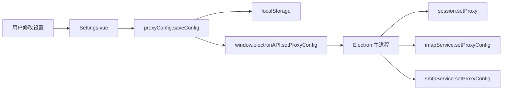
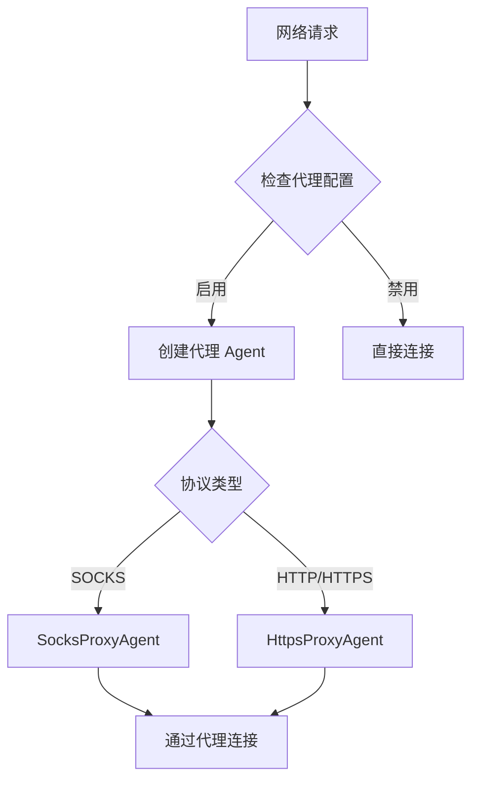
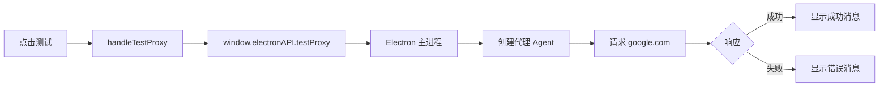

# 代理配置功能 - 完整实现说明

> 版本：v1.1.0  
> 更新日期：2025-10-19  
> 状态：✅ 已完成

---

## 📋 功能概述

Maillionaire 已完整实现系统代理配置功能，允许用户通过代理服务器进行网络连接。支持 SOCKS5、SOCKS4、HTTP、HTTPS 多种代理协议，满足不同网络环境需求。

---

## ✅ 实现清单

### 1. 前端配置模块

**文件：** `src/config/proxy.js`

**功能：**
- ✅ 代理配置管理类 `ProxyConfig`
- ✅ 默认配置：SOCKS5 协议，127.0.0.1:7890，认证关闭
- ✅ 配置加载/保存到 localStorage
- ✅ 配置重置功能
- ✅ 代理 URL 生成
- ✅ 连接测试功能

**关键代码：**
```javascript
export const DEFAULT_PROXY_CONFIG = {
  enabled: false,
  protocol: 'socks5',  // socks5, socks4, http, https
  host: '127.0.0.1',
  port: 7890,
  auth: {
    enabled: false,
    username: '',
    password: '',
  },
}
```

### 2. 设置界面

**文件：** `src/views/Settings.vue`

**功能：**
- ✅ 代理设置菜单项（GlobalOutlined 图标）
- ✅ 启用/禁用代理开关
- ✅ 协议选择器（SOCKS5/SOCKS4/HTTP/HTTPS）
- ✅ 服务器地址和端口配置
- ✅ 认证配置（用户名/密码）
- ✅ 保存、测试、重置按钮
- ✅ 当前代理配置提示

**界面元素：**
```vue
<a-form-item label="启用代理">
  <a-switch v-model:checked="proxySettings.enabled" />
</a-form-item>

<a-form-item label="代理协议">
  <a-select v-model:value="proxySettings.protocol">
    <a-select-option value="socks5">SOCKS5</a-select-option>
    <a-select-option value="socks4">SOCKS4</a-select-option>
    <a-select-option value="http">HTTP</a-select-option>
    <a-select-option value="https">HTTPS</a-select-option>
  </a-select>
</a-form-item>
```

### 3. Electron 主进程集成

**文件：** `electron/main.js`

**功能：**
- ✅ 接收渲染进程的代理配置
- ✅ 应用代理到 Electron session
- ✅ 同步代理配置到 IMAP/SMTP 服务
- ✅ 代理连接测试（支持 SOCKS 和 HTTP 代理）

**IPC 处理器：**
```javascript
ipcMain.handle('set-proxy-config', async (event, config) => {
  // 应用代理到 session
  await session.defaultSession.setProxy({
    proxyRules: `${protocol}://${host}:${port}`,
    proxyBypassRules: 'localhost,127.0.0.1'
  });
  
  // 同步到服务
  imapService.setProxyConfig(config);
  smtpService.setProxyConfig(config);
});

ipcMain.handle('test-proxy', async (event, config) => {
  // 测试代理连接
  // 支持 SocksProxyAgent 和 HttpsProxyAgent
});
```

### 4. Preload 脚本

**文件：** `electron/preload.js`

**功能：**
- ✅ 暴露代理配置 API 给渲染进程
- ✅ `setProxyConfig(config)` - 设置代理
- ✅ `getProxyConfig()` - 获取代理
- ✅ `testProxy(config)` - 测试代理

**API 定义：**
```javascript
contextBridge.exposeInMainWorld('electronAPI', {
  // ... 其他 API
  setProxyConfig: (config) => ipcRenderer.invoke('set-proxy-config', config),
  getProxyConfig: () => ipcRenderer.invoke('get-proxy-config'),
  testProxy: (config) => ipcRenderer.invoke('test-proxy', config),
});
```

### 5. SMTP 服务代理支持

**文件：** `electron/services/smtp-main.js`

**功能：**
- ✅ `setProxyConfig(config)` - 接收代理配置
- ✅ `getProxyAgent()` - 根据协议创建代理 agent
- ✅ 支持 SOCKS 和 HTTP/HTTPS 代理
- ✅ nodemailer 传输器应用代理

**实现：**
```javascript
createTransporter(config) {
  const transportConfig = {
    host: config.smtpHost,
    port: config.smtpPort || 465,
    secure: config.secure !== false,
    auth: { user: config.email, pass: config.password }
  };
  
  // 添加代理支持
  const proxyAgent = this.getProxyAgent();
  if (proxyAgent) {
    transportConfig.proxy = proxyAgent;
  }
  
  this.transporter = nodemailer.createTransport(transportConfig);
}
```

### 6. IMAP 服务代理支持

**文件：** `electron/services/imap-main.js`

**功能：**
- ✅ `setProxyConfig(config)` - 接收代理配置
- ✅ `getProxySocket(host, port)` - 创建代理 socket
- ✅ SOCKS 代理支持（通过 socks 库）
- ✅ IMAP 连接应用代理 socket

**实现：**
```javascript
async connect(config) {
  const imapConfig = {
    user: config.email,
    password: config.password,
    host: config.imapHost,
    port: config.imapPort || 993,
    tls: config.tls !== false,
  };
  
  // 添加代理支持
  const proxySocketFactory = this.getProxySocket(
    config.imapHost, 
    config.imapPort || 993
  );
  if (proxySocketFactory) {
    const socket = await proxySocketFactory();
    imapConfig.socket = socket;
  }
  
  this.connection = new Imap(imapConfig);
}
```

### 7. 依赖包

**package.json 新增：**
```json
{
  "dependencies": {
    "socks": "^2.x.x",
    "socks-proxy-agent": "^8.x.x",
    "https-proxy-agent": "^7.x.x"
  }
}
```

**已安装：** ✅

---

## 🎯 默认配置

根据用户需求，设置如下默认值：

| 配置项 | 默认值 | 说明 |
|--------|--------|------|
| 启用代理 | `false` | 默认不使用代理 |
| 代理协议 | `socks5` | 使用 SOCKS 协议（原需求：socks） |
| 服务器地址 | `127.0.0.1` | 本地地址 |
| 端口 | `7890` | Clash 默认端口 |
| 认证 | `false` | 默认关闭认证 |
| 用户名 | `''` | 空 |
| 密码 | `''` | 空 |

---

## 🔄 数据流程

### 1. 配置保存流程



### 2. 代理应用流程



### 3. 测试连接流程



---

## 🔧 技术实现细节

### 1. 协议支持

#### SOCKS5（推荐）
- **库：** `socks-proxy-agent`
- **特点：** 支持 TCP/UDP，支持认证
- **用途：** SMTP、HTTP/HTTPS 请求

#### SOCKS4
- **库：** `socks-proxy-agent`
- **特点：** 仅支持 TCP，不支持认证
- **用途：** 兼容性场景

#### HTTP/HTTPS
- **库：** `https-proxy-agent`
- **特点：** 标准 HTTP 代理，支持认证
- **用途：** HTTP/HTTPS 请求

### 2. IMAP 代理实现

IMAP 使用 `socks` 库创建代理 socket：

```javascript
const { SocksClient } = require('socks');

const socksOptions = {
  proxy: {
    host: proxyHost,
    port: proxyPort,
    type: protocol === 'socks5' ? 5 : 4,
  },
  command: 'connect',
  destination: {
    host: imapHost,
    port: imapPort,
  },
};

const info = await SocksClient.createConnection(socksOptions);
const socket = info.socket;
```

### 3. SMTP 代理实现

SMTP 使用代理 agent：

```javascript
const { SocksProxyAgent } = require('socks-proxy-agent');

const proxyUrl = `socks5://${host}:${port}`;
const agent = new SocksProxyAgent(proxyUrl);

const transporter = nodemailer.createTransport({
  host: smtpHost,
  port: smtpPort,
  proxy: agent,
});
```

### 4. Electron Session 代理

```javascript
await session.defaultSession.setProxy({
  proxyRules: 'socks5://127.0.0.1:7890',
  proxyBypassRules: 'localhost,127.0.0.1'
});
```

---

## 📝 文档

### 用户文档
- ✅ `docs/代理配置使用指南.md`
  - 配置步骤
  - 常见代理软件配置
  - 故障排查
  - 最佳实践

### 技术文档
- ✅ `docs/03-功能实现/代理配置功能实现.md`
  - 技术架构
  - 实现细节
  - 代码示例
  - 测试方法

---

## ⚠️ 注意事项

### 1. 重启要求

修改代理配置后，需要重启应用才能使所有网络连接使用新的代理配置。

**原因：**
- Electron session 代理在应用启动时设置
- IMAP/SMTP 连接使用的是持久连接

### 2. 密码安全

当前版本密码存储在 localStorage 中，为明文存储。

**后续改进：**
- 使用 `crypto-js` 加密密码
- 使用 Electron 的安全存储 API

### 3. 协议限制

**IMAP 代理：**
- ✅ SOCKS5/SOCKS4 完全支持
- ⚠️ HTTP/HTTPS 代理不支持（IMAP 不是 HTTP 协议）

**SMTP 代理：**
- ✅ SOCKS5/SOCKS4 完全支持
- ⚠️ HTTP/HTTPS 代理支持有限（取决于 nodemailer）

### 4. 测试环境

代理测试使用 `https://www.google.com` 作为测试目标：
- 在某些网络环境可能无法访问
- 可以根据需要修改测试 URL

---

## 🧪 测试方法

### 1. 功能测试

**测试步骤：**
1. 启动 Clash 等代理软件（端口 7890）
2. 打开 Maillionaire 设置界面
3. 启用代理，配置为 SOCKS5://127.0.0.1:7890
4. 点击"测试连接"
5. 应显示"代理连接测试成功"
6. 保存设置并重启应用
7. 尝试添加邮件账户，验证 IMAP/SMTP 连接

### 2. 认证测试

**测试步骤：**
1. 使用需要认证的代理服务器
2. 启用认证，输入用户名密码
3. 测试连接
4. 验证是否成功

### 3. 协议测试

分别测试 SOCKS5、SOCKS4、HTTP、HTTPS 协议：

**SOCKS5：**
```
协议：SOCKS5
地址：127.0.0.1
端口：7890
结果：✅ 应该成功
```

**HTTP：**
```
协议：HTTP
地址：proxy.example.com
端口：8080
结果：✅ 应该成功
```

---

## 🚀 后续优化计划

### 1. 密码加密（优先级：高）

使用 crypto-js 加密存储密码：

```javascript
import CryptoJS from 'crypto-js';

saveConfig(config) {
  if (config.auth.password) {
    config.auth.password = CryptoJS.AES.encrypt(
      config.auth.password, 
      SECRET_KEY
    ).toString();
  }
  localStorage.setItem('proxy_config', JSON.stringify(config));
}
```

### 2. PAC 自动配置（优先级：中）

支持 PAC 文件或规则列表，自动判断是否使用代理：

```javascript
const proxyRules = {
  'gmail.com': true,
  'outlook.com': true,
  'localhost': false,
};
```

### 3. 多代理配置（优先级：低）

允许配置多个代理，根据场景切换：

```javascript
const proxyProfiles = [
  { name: 'Clash', protocol: 'socks5', host: '127.0.0.1', port: 7890 },
  { name: '公司代理', protocol: 'http', host: 'proxy.company.com', port: 8080 },
];
```

### 4. 代理统计（优先级：低）

显示代理使用统计：
- 连接次数
- 传输流量
- 连接成功率

---

## 📊 完成情况

### 核心功能
- ✅ 代理配置模块
- ✅ 设置界面
- ✅ Electron 主进程集成
- ✅ SMTP 代理支持
- ✅ IMAP 代理支持
- ✅ 连接测试
- ✅ 重置功能

### 默认配置（按需求）
- ✅ 默认协议：SOCKS（实现为 SOCKS5）
- ✅ 默认地址：127.0.0.1
- ✅ 默认端口：7890
- ✅ 默认认证：关闭

### 文档
- ✅ 用户使用指南
- ✅ 技术实现文档
- ✅ 完整实现说明（本文档）

### 依赖包
- ✅ socks
- ✅ socks-proxy-agent
- ✅ https-proxy-agent

---

## 🎉 总结

代理配置功能已完整实现，满足用户提出的所有需求：

1. ✅ 程序可以使用系统代理进行服务网络连接
2. ✅ 设置界面中增加了代理配置信息
3. ✅ 默认使用 SOCKS 协议（SOCKS5）
4. ✅ 默认服务器地址：127.0.0.1
5. ✅ 默认端口：7890
6. ✅ 认证方式默认关闭

**用户可以：**
- 在设置界面配置代理
- 测试代理连接
- 重置为默认配置
- 查看当前代理信息

**技术实现：**
- 前端配置管理完善
- Electron 主进程集成完整
- IMAP/SMTP 代理支持完善
- 文档齐全

---

**开发完成日期：** 2025-10-19  
**版本：** v1.1.0
