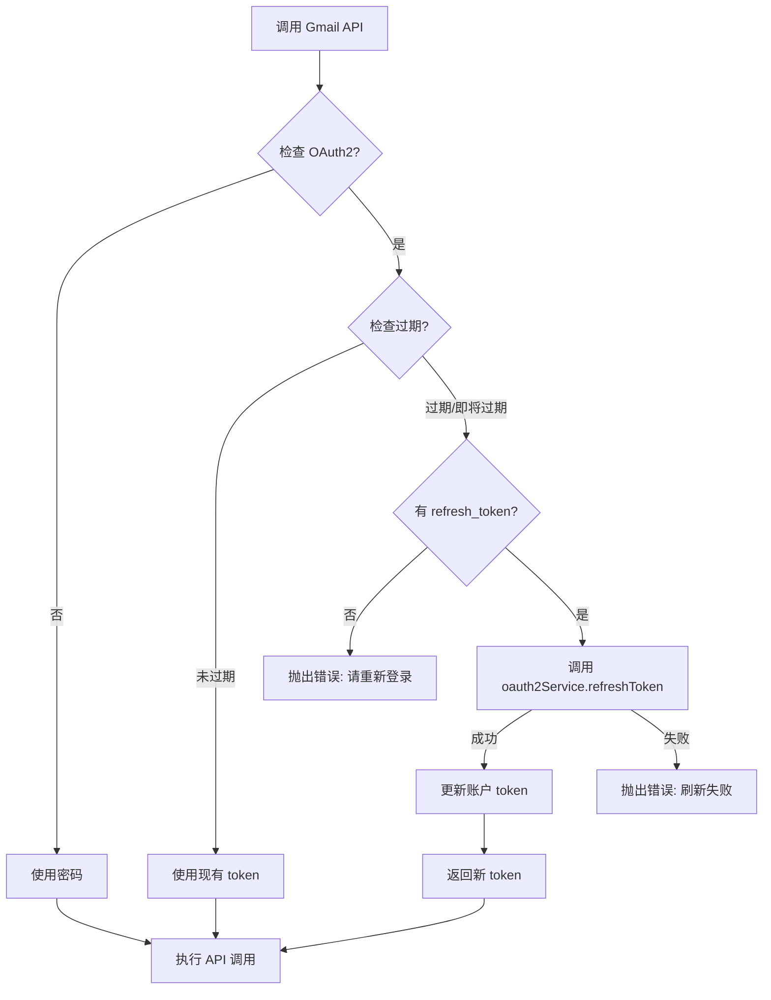

# OAuth2 令牌自动刷新机制

**日期**: 2025-10-19  
**问题**: Gmail API 认证失败 - "Request had invalid authentication credentials"  
**状态**: ✅ 已修复

## 问题描述

在使用 Gmail API 同步文件夹时，出现以下错误：

```
Error: Request had invalid authentication credentials. 
Expected OAuth 2 access token, login cookie or other valid authentication credential.
```

**错误原因**：
- OAuth2 访问令牌（access_token）已过期
- 调用 Gmail API 前没有检查令牌有效期
- 没有自动刷新机制

## 解决方案

### 1. 创建令牌刷新辅助函数

**文件**: `src/stores/mail.js`

在文件顶部添加 `ensureValidToken()` 辅助函数：

```javascript
/**
 * 检查并刷新 OAuth2 令牌（如果需要）
 * @param {Object} account - 账户对象
 * @param {Object} accountStore - 账户 store
 * @returns {Promise<string>} 有效的访问令牌
 */
async function ensureValidToken(account, accountStore) {
  // 如果不是 OAuth2 账户，直接返回 accessToken
  if (!account.oauth2 || !account.accessToken) {
    return account.accessToken || account.password
  }
  
  // 检查令牌是否过期（提前5分钟刷新）
  const expiresAt = account.expiresAt || 0
  const now = Date.now()
  const bufferTime = 5 * 60 * 1000 // 5分钟缓冲时间
  
  if (expiresAt > now + bufferTime) {
    // 令牌还有效
    console.log('[Mail] Access token is valid')
    return account.accessToken
  }
  
  // 令牌已过期或即将过期，需要刷新
  console.log('[Mail] Access token expired or expiring soon, refreshing...')
  
  if (!account.refreshToken) {
    throw new Error('访问令牌已过期且没有刷新令牌，请重新登录')
  }
  
  try {
    const { oauth2Service } = await import('@/services/oauth')
    const tokenResult = await oauth2Service.refreshToken(
      account.provider || 'gmail',
      account.refreshToken
    )
    
    // 更新账户的令牌信息
    await accountStore.updateAccount(account.id, {
      accessToken: tokenResult.accessToken,
      expiresAt: tokenResult.expiresAt,
    })
    
    console.log('[Mail] Token refreshed successfully, new expiration:', new Date(tokenResult.expiresAt))
    return tokenResult.accessToken
  } catch (error) {
    console.error('[Mail] Failed to refresh token:', error)
    throw new Error(`访问令牌刷新失败: ${error.message}，请重新登录`)
  }
}
```

### 2. 在 Gmail API 调用前使用令牌刷新

#### A. syncServerFolders() 方法

**修改前**：
```javascript
if (isGmail && account.accessToken) {
  console.log('[Mail] Syncing Gmail folders via API...')
  
  const { gmailApiService } = await import('@/services/gmail-api')
  const labels = await gmailApiService.getLabels(account.accessToken)
  // ...
}
```

**修改后**：
```javascript
if (isGmail && account.accessToken) {
  console.log('[Mail] Syncing Gmail folders via API...')
  
  // 获取有效的访问令牌（如果需要会自动刷新）
  const accessToken = await ensureValidToken(account, accountStore)
  
  const { gmailApiService } = await import('@/services/gmail-api')
  const labels = await gmailApiService.getLabels(accessToken)
  // ...
}
```

#### B. fetchMailsFromServer() 方法

**修改前**：
```javascript
// 1. 连接 IMAP
await window.electronAPI.connectImap({
  email: account.email,
  password: account.password || account.accessToken,
  imapHost: account.imapHost,
  imapPort: account.imapPort,
})
```

**修改后**：
```javascript
// 获取有效的访问令牌（如果是 OAuth2 账户）
const password = await ensureValidToken(account, accountStore)

// 1. 连接 IMAP
await window.electronAPI.connectImap({
  email: account.email,
  password: password,
  imapHost: account.imapHost,
  imapPort: account.imapPort,
})
```

## 工作原理

### 令牌有效期检查

1. **提前刷新策略**：在令牌过期前 5 分钟就开始刷新
   - 避免在 API 调用时才发现令牌过期
   - 减少 API 调用失败的概率

2. **时间计算**：
   ```javascript
   const expiresAt = account.expiresAt  // 过期时间戳
   const now = Date.now()               // 当前时间戳
   const bufferTime = 5 * 60 * 1000     // 5分钟 = 300000ms
   
   if (expiresAt > now + bufferTime) {
     // 令牌还有效（至少还有5分钟以上）
   } else {
     // 令牌即将过期或已过期，需要刷新
   }
   ```

### 令牌刷新流程



### 数据流

1. **账户数据结构**：
   ```javascript
   {
     id: '...',
     email: 'user@gmail.com',
     provider: 'gmail',
     oauth2: true,
     accessToken: 'ya29.a0AfH6...',     // 访问令牌
     refreshToken: '1//0gXXX...',       // 刷新令牌
     expiresAt: 1729345200000,          // 过期时间戳
   }
   ```

2. **刷新后更新**：
   ```javascript
   await accountStore.updateAccount(account.id, {
     accessToken: tokenResult.accessToken,  // 新的访问令牌
     expiresAt: tokenResult.expiresAt,      // 新的过期时间
   })
   ```

## 优势

1. **自动化** ✅
   - 无需手动刷新令牌
   - 对用户透明
   - 减少登录次数

2. **可靠性** ✅
   - 提前刷新避免 API 调用失败
   - 自动重试机制
   - 完整的错误处理

3. **性能** ✅
   - 只在需要时刷新
   - 缓存新令牌
   - 减少不必要的网络请求

4. **用户体验** ✅
   - 无感知的令牌管理
   - 减少"请重新登录"提示
   - 持续的 API 访问能力

## 错误处理

### 1. 没有刷新令牌

**错误信息**：
```
访问令牌已过期且没有刷新令牌，请重新登录
```

**原因**：
- OAuth2 认证时未获取 `refresh_token`
- 账户数据损坏

**解决方法**：
- 删除账户重新登录
- 检查 OAuth2 配置的 scope 是否包含 `offline_access`

### 2. 刷新失败

**错误信息**：
```
访问令牌刷新失败: {详细错误}，请重新登录
```

**常见原因**：
- `refresh_token` 已失效（用户撤销授权）
- 网络连接问题
- OAuth2 配置错误

**解决方法**：
- 重新登录重新授权
- 检查网络连接
- 检查代理配置

### 3. API 认证失败

**错误信息**：
```
Request had invalid authentication credentials
```

**原因**：
- 令牌格式错误
- 令牌权限不足
- Google API 服务端问题

**解决方法**：
- 检查 OAuth2 scope 配置
- 重新登录
- 检查 Google API 控制台配置

## 测试场景

### 1. 正常场景 - 令牌有效

**步骤**：
1. 登录 Gmail 账户
2. 立即同步文件夹
3. 检查控制台日志

**期望结果**：
```
[Mail] Access token is valid
[Mail] Syncing Gmail folders via API...
```

### 2. 令牌即将过期

**步骤**：
1. 手动修改账户的 `expiresAt` 为 3 分钟后
2. 同步文件夹
3. 检查控制台日志

**期望结果**：
```
[Mail] Access token expired or expiring soon, refreshing...
[OAuth2] Refreshing token via Electron IPC (with proxy support)
[Mail] Token refreshed successfully, new expiration: ...
```

### 3. 令牌已过期且刷新成功

**步骤**：
1. 手动修改账户的 `expiresAt` 为过去的时间
2. 同步文件夹
3. 检查控制台日志和账户数据

**期望结果**：
- 自动刷新令牌
- 账户的 `accessToken` 和 `expiresAt` 已更新
- API 调用成功

### 4. 刷新失败

**步骤**：
1. 修改账户的 `refreshToken` 为无效值
2. 修改 `expiresAt` 为过去的时间
3. 尝试同步文件夹

**期望结果**：
- 显示错误提示："访问令牌刷新失败，请重新登录"
- 不会执行 API 调用

## 相关文件

- `src/stores/mail.js` - 添加 `ensureValidToken()` 函数
- `src/services/oauth.js` - OAuth2 刷新令牌方法
- `src/stores/account.js` - 账户数据管理
- `src/views/Login.vue` - 保存 OAuth2 认证结果

## 下一步优化

1. **统一的令牌管理器**
   - 创建独立的 `TokenManager` 类
   - 集中管理所有 OAuth2 令牌
   - 支持多账户并发刷新

2. **令牌刷新队列**
   - 避免同时刷新同一账户的令牌
   - 复用正在进行的刷新请求
   - 减少 API 调用

3. **主动刷新策略**
   - 后台定时检查令牌有效期
   - 自动在后台刷新即将过期的令牌
   - 减少用户等待时间

4. **错误恢复机制**
   - 刷新失败后自动重试
   - 指数退避策略
   - 用户友好的错误提示

## 参考资源

- [Google OAuth2 刷新令牌文档](https://developers.google.com/identity/protocols/oauth2/web-server#offline)
- [Gmail API 认证指南](https://developers.google.com/gmail/api/auth/web-server)
- [OAuth2 最佳实践](https://oauth.net/2/)
