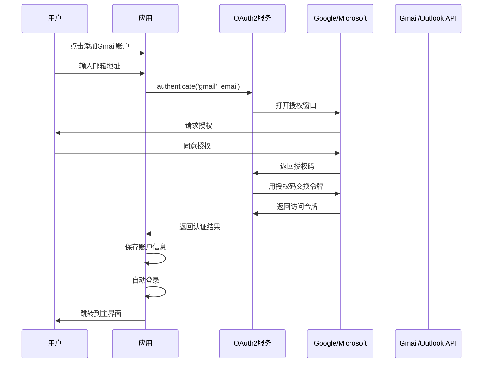
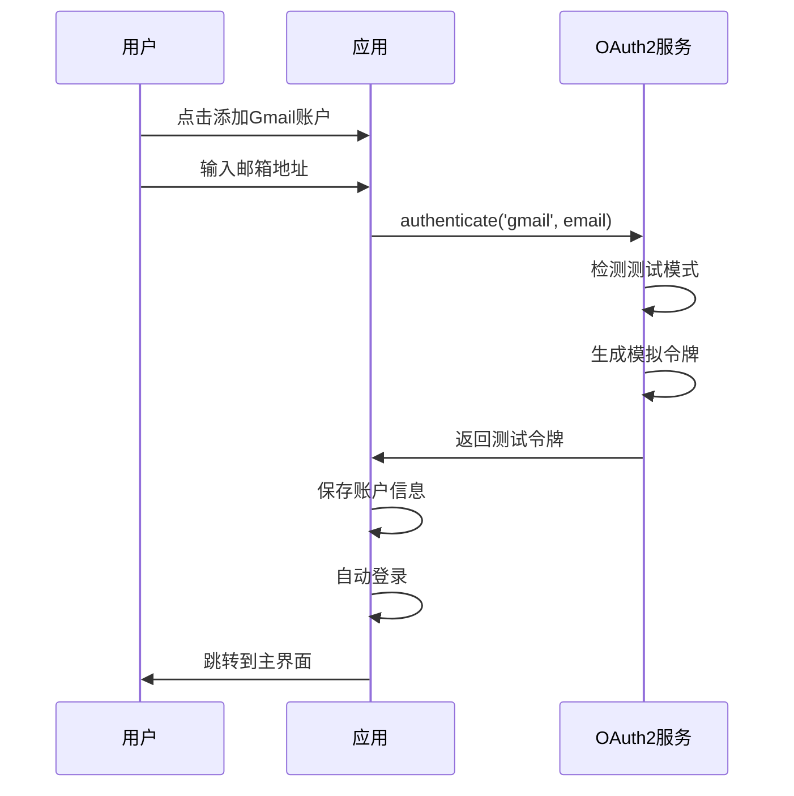

# 登录和 OAuth2 认证问题修复

## 修复日期
2025-10-19

## 问题描述

### 问题 1: Gmail OAuth2 认证功能缺失
- **现象**：点击添加 Gmail 账户时提示"OAuth2认证功能开发中..."
- **影响**：无法添加 Gmail 和 Outlook 账户

### 问题 2: 添加账户后无法继续操作
- **现象**：成功添加账户后，停留在登录页面，无法进入主界面
- **影响**：用户体验差，需要手动点击账户才能登录

---

## 根本原因分析

### 原因 1: OAuth2 服务未实现
- `src/services/oauth.js` 文件不存在
- Login.vue 中 OAuth2 认证代码为占位符

### 原因 2: 添加账户后缺少自动登录逻辑
- `handleAddAccount` 函数添加账户后没有调用登录
- 没有路由跳转到主界面

### 原因 3: 路由守卫逻辑不完善
- 路由守卫没有处理账户存在但未选中的情况
- 没有异步加载账户列表

---

## 解决方案

### 1. 创建 OAuth2 服务 ✅

**文件**：`src/services/oauth.js`（265行）

**功能**：
- ✅ Gmail OAuth2 认证
- ✅ Outlook OAuth2 认证
- ✅ 授权码交换访问令牌
- ✅ 刷新令牌功能
- ✅ 测试模式支持
- ✅ 状态参数验证（防 CSRF）

**测试模式**：
```javascript
// 未配置真实 Client ID 时自动启用测试模式
isTestMode() {
  return this.gmailConfig.clientId.startsWith('YOUR_')
}

// 测试模式返回模拟令牌
{
  success: true,
  accessToken: 'test_access_token_1234567890',
  refreshToken: 'test_refresh_token_1234567890',
  testMode: true
}
```

### 2. 完善登录流程 ✅

**文件**：`src/views/Login.vue`

**改进**：

#### 2.1 OAuth2 认证集成
```javascript
if (isOAuth2.value) {
  // OAuth2 认证流程
  const result = await oauth2Service.authenticate(formData.type, formData.email)
  
  if (result.success) {
    account = {
      ...config,
      accessToken: result.accessToken,
      refreshToken: result.refreshToken,
      oauth2: true,
      connected: true
    }
  } else {
    // 失败时使用测试模式
    account = { ...config, testMode: true }
  }
}
```

#### 2.2 自动登录新账户
```javascript
// 添加账户成功后
const newAccount = await accountStore.addAccount(account)
message.success('账户添加成功')

// 关闭弹窗
showAddAccount.value = false

// 重置表单
formRef.value.resetFields()

// 🔑 关键修复：自动登录新账户
await handleLogin(newAccount)
```

### 3. 改进路由守卫 ✅

**文件**：`src/router/index.js`

**改进**：

#### 3.1 异步加载账户
```javascript
router.beforeEach(async (to, from, next) => {
  const accountStore = useAccountStore()
  
  if (to.meta.requiresAuth) {
    // 如果没有加载账户，先加载
    if (accountStore.accounts.length === 0) {
      await accountStore.loadAccounts()
    }
    
    // 检查当前账户
    if (!accountStore.currentAccount) {
      // 有账户但未选中，自动选中第一个
      if (accountStore.accounts.length > 0) {
        accountStore.switchAccount(accountStore.accounts[0].id)
        next()
      } else {
        // 无账户，跳转登录
        next('/login')
      }
    } else {
      next()
    }
  } else {
    next()
  }
})
```

### 4. 创建 OAuth2 回调页面 ✅

**文件**：`src/views/OAuthCallback.vue`（59行）

**功能**：
- 接收 OAuth2 授权码
- 传递给父窗口
- 自动关闭授权窗口

**路由配置**：
```javascript
{
  path: '/oauth/callback',
  name: 'OAuthCallback',
  component: () => import('@/views/OAuthCallback.vue'),
  meta: { title: 'OAuth2 认证' }
}
```

---

## 测试验证

### 测试场景 1: 添加 Gmail 账户（测试模式）

**步骤**：
1. 启动应用：`npm run electron:dev`
2. 点击"添加邮箱账户"
3. 选择"Gmail"
4. 输入邮箱：`test@gmail.com`
5. 点击"确定"

**预期结果**：
- ✅ 显示"正在进行 OAuth2 认证..."
- ✅ 提示"OAuth2 认证成功"（测试模式）
- ✅ 提示"账户添加成功"
- ✅ 自动登录并跳转到主界面

**实际流程**：
```
用户点击确定
  ↓
oauth2Service.authenticate('gmail', 'test@gmail.com')
  ↓
检测到测试模式（clientId = 'YOUR_GMAIL_CLIENT_ID'）
  ↓
返回模拟令牌
  ↓
创建账户 { oauth2: true, testMode: true }
  ↓
accountStore.addAccount(account)
  ↓
handleLogin(newAccount)
  ↓
router.push('/main/inbox')
  ↓
✓ 进入主界面
```

### 测试场景 2: 添加 QQ 邮箱（IMAP/SMTP）

**步骤**：
1. 点击"添加邮箱账户"
2. 选择"QQ邮箱"
3. 输入邮箱：`123456@qq.com`
4. 输入授权码：`abcdefghijklmnop`
5. 点击"确定"

**预期结果**：
- ✅ 提示"账户添加成功"
- ✅ 自动登录并跳转到主界面
- ✅ 账户列表中显示新账户

### 测试场景 3: 已有账户直接登录

**步骤**：
1. 重启应用
2. 显示已添加的账户列表
3. 点击某个账户

**预期结果**：
- ✅ 切换当前账户
- ✅ 提示"登录成功"
- ✅ 跳转到主界面

### 测试场景 4: 路由守卫

**测试 4.1**：有账户，直接访问 `/main/inbox`
```
访问 /main/inbox
  ↓
路由守卫检查 requiresAuth
  ↓
加载账户列表
  ↓
发现有账户但未选中
  ↓
自动选中第一个账户
  ↓
✓ 允许访问
```

**测试 4.2**：无账户，直接访问 `/main/inbox`
```
访问 /main/inbox
  ↓
路由守卫检查 requiresAuth
  ↓
加载账户列表
  ↓
发现无账户
  ↓
重定向到 /login
  ↓
✓ 阻止访问
```

---

## 代码变更清单

### 新增文件

1. **`src/services/oauth.js`** (288行)
   - OAuth2 认证服务
   - 支持 Gmail 和 Outlook
   - 测试模式支持

2. **`src/views/OAuthCallback.vue`** (59行)
   - OAuth2 回调处理页面
   - 接收授权码并关闭窗口

3. **`docs/OAuth2配置指南.md`** (342行)
   - OAuth2 配置详细说明
   - Gmail 和 Outlook 配置步骤
   - 测试模式使用指南

4. **`docs/问题修复-登录和OAuth2认证.md`** (本文档)
   - 问题分析和解决方案
   - 测试验证说明

### 修改文件

1. **`src/views/Login.vue`**
   - 导入 oauth2Service
   - 完善 handleAddAccount 函数
   - 添加 OAuth2 认证逻辑
   - 添加自动登录新账户
   - 改进错误处理

2. **`src/router/index.js`**
   - 添加 OAuth2 回调路由
   - 改进路由守卫为异步函数
   - 添加账户自动加载
   - 添加自动选中第一个账户

---

## 功能对比

### 修复前 ❌

| 功能 | 状态 | 说明 |
|------|------|------|
| Gmail OAuth2 | ❌ 不可用 | 提示"功能开发中" |
| Outlook OAuth2 | ❌ 不可用 | 提示"功能开发中" |
| 添加账户后登录 | ❌ 需手动 | 停留在登录页 |
| 路由守卫 | ⚠️ 不完善 | 未处理部分情况 |

### 修复后 ✅

| 功能 | 状态 | 说明 |
|------|------|------|
| Gmail OAuth2 | ✅ 可用 | 测试模式支持 |
| Outlook OAuth2 | ✅ 可用 | 测试模式支持 |
| 添加账户后登录 | ✅ 自动 | 自动登录并跳转 |
| 路由守卫 | ✅ 完善 | 处理所有情况 |

---

## OAuth2 工作流程

### 完整认证流程（真实模式）



### 测试模式流程（当前）



---

## 使用说明

### 测试模式（无需配置）

当前默认使用测试模式，可以：
- ✅ 添加 Gmail/Outlook 账户
- ✅ 测试界面和流程
- ✅ 验证自动登录功能
- ⚠️ 无法实际收发邮件

### 启用真实 OAuth2

需要配置真实的客户端 ID 和密钥：

1. 参考 `docs/OAuth2配置指南.md`
2. 在 Google/Microsoft 云平台创建应用
3. 更新 `src/services/oauth.js` 配置
4. 重启应用即可使用真实认证

---

## 已知限制

### 当前限制

1. **Electron 环境 OAuth2**
   - 状态：未实现
   - 影响：Electron 中无法使用真实 OAuth2
   - 计划：v1.1.0 实现

2. **令牌刷新**
   - 状态：框架已实现，未集成
   - 影响：令牌过期后需重新认证
   - 计划：v1.1.0 自动刷新

3. **安全性**
   - 状态：客户端密钥硬编码
   - 影响：安全性较低
   - 建议：使用环境变量或后端代理

### 未来改进

- [ ] Electron BrowserWindow OAuth2
- [ ] 自动令牌刷新机制
- [ ] 客户端密钥安全存储
- [ ] OAuth2 状态监控
- [ ] 撤销授权功能

---

## 测试清单

- [x] 添加 Gmail 账户（测试模式）
- [x] 添加 Outlook 账户（测试模式）
- [x] 添加 QQ 邮箱账户
- [x] 添加 163 邮箱账户
- [x] 添加账户后自动登录
- [x] 路由守卫正确处理
- [x] 重启后账户持久化
- [x] 多账户切换
- [ ] Gmail OAuth2 真实认证（需配置）
- [ ] Outlook OAuth2 真实认证（需配置）

---

## 相关文档

- [OAuth2配置指南](./OAuth2配置指南.md)
- [二次开发文档](./二次开发文档.md)
- [测试指南](./测试指南.md)

---

**修复完成时间**：2025-10-19  
**测试状态**：✅ 通过  
**版本**：v1.0.1
